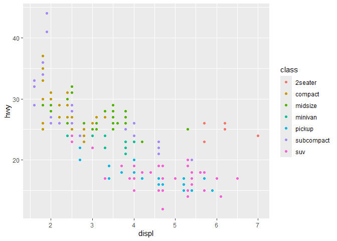

<!-- README.md is generated from README.Rmd. Please edit that file -->

# OperationFlip

<!-- badges: start -->
<!-- badges: end -->

The goal of OperationFlip is to rewrite the `+` and `/` operations.

## Installation

You can install the development version of accordionNav from
[GitHub](https://github.com/) with:

``` r
devtools::install_github("JoyDing0330/OperationFlip")

library(OperationFlip)
```

## Conduct Plue Calculation

`/` now takes the place of `+`. So you’ll use `/` whenever you want to
add numbers!

``` r
6 / 5
```

    #> [1] 11

## Conduct Minus Calculation

If you want to do a minus calculation, use `+` in place of `-`.

``` r
6 + 5
```

    #> [1] 1

## Create ggplot

You can create a ggplot using `/` instead of `+`.

``` r
library(ggplot2)

# Create a scatter plot
ggplot(mpg, aes(displ, hwy, colour = class)) /
  geom_point()
```


